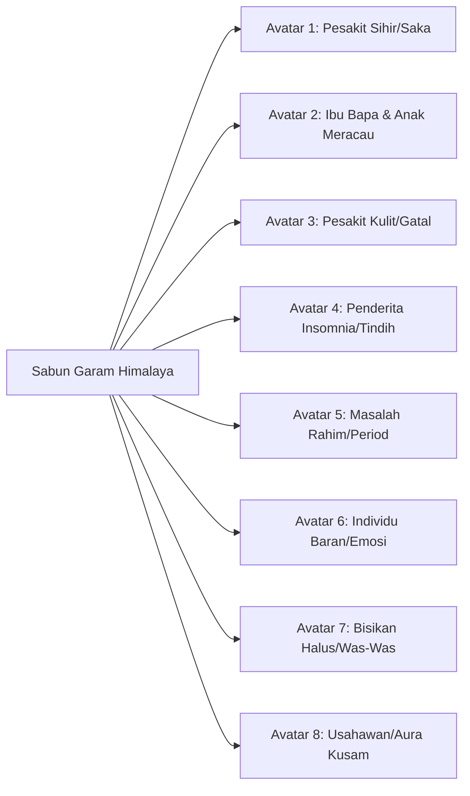

# 🧂 BLUEPRINT LENGKAP: SABUN GARAM HIMALAYA PENGISIAN (RUQYAH SYARIYYAH)

Dokumen ini merupakan panduan rujukan menyeluruh (*master reference blueprint*) bagi produk **Sabun Garam Himalaya Pengisian ESyifaa**. Dokumen ini merangkumi penerangan produk, asas sains & syarak, manfaat fizikal & spiritual, profil sasaran audiens, bank angle pemasaran, SOP penggunaan, serta strategi funnel jualan.

---

## 1. PENERANGAN PRODUK & KONSEP TERAS

### Apakah Produk Ini?
Sabun Garam Himalaya Pengisian ESyifaa adalah sabun rawatan mandian herba & mineral yang menggabungkan khasiat fizikal **Garam Bukit Himalaya Tulen** bersama kaedah **Pengisian Ayat-Ayat Ruqyah Syar’iyyah** oleh perawat bertauliah secara jarak jauh.

### Dua Dimensi Keberkesanan:
1. **Dimensi Fizikal & Saintifik (Garam Bukit Himalaya):**
   * Mengandungi lebih 84 mineral surih semula jadi (besi, magnesium, kalium, kalsium).
   * Bersifat antiseptik dan antibakteria semula jadi yang membersihkan liang roma secara mendalam (*deep detox*).
   * Mengeluarkan ion negatif yang meneutralkan cas ion positif toksik pada tubuh manusia (punca stres dan kelesuan).
   * Melembutkan kulit, mematikan kuman gatal, serta melancarkan peredaran darah pada urat-urat saraf yang tegang.

2. **Dimensi Rohani & Syar’iyyah (Pengisian Ruqyah):**
   * Diisikan dengan bacaan 4 lapisan ayat Al-Quran dan doa syifa’ sahih:
     * 🔥 *Ayat-ayat Pembakar & Pemusnah Jin*
     * ✂️ *Ayat-ayat Pembatal Sihir & Ikatan Santau*
     * 🛡️ *Ayat-ayat Pendinding & Benteng Perlindungan*
     * 💚 *Ayat-ayat Kesembuhan (Syifa') & Ketenangan Jiwa*
   * Garam berfungsi sebagai medium penyimpan getaran bacaan Al-Quran yang meleraikan cas-cas gangguan halus yang menempel pada tubuh.

> [!IMPORTANT]
> **DOKTRIN SYARAK (BUKAN TANGKAL / AZIMAT):**  
> Sabun ini **BUKAN** tangkal ajaib yang memberi perlindungan secara magis hanya kerana ia wujud di bilik air. Ia adalah **Alat Ikhtiar Syar'iyyah Aktif yang mempunyai tatacara penggunaan dan doa**. Kesembuhan 100% milik Allah SWT; sabun dan ayat ruqyah bertindak sebagai asbab pembersih zahir dan batin.

---

## 2. KELEBIHAN & MANFAAT MENYELURUH

### A. Manfaat Spiritual & Mistik (Pembersihan Gangguan):
* **Meleraikan Sisa Ikatan Jin:** Membakar jin yang bersembunyi di bawah lapisan kulit, liang roma, dan saluran darah.
* **Memutuskan Sihir Hantaran:** Membilas aura kotor akibat sihir pemisah, sihir penutup rezeki, dan santau angin.
* **Meredakan Saka Keturunan:** Mengurangkan tekanan angin saka yang kerap berkumpul di bahagian belikat dan tengkuk.
* **Menghilangkan Bisikan Halus:** Menenangkan lintasan hati yang celaru, was-was solat, dan bisikan yang menghasut kemarahan.
* **Mencegah Gangguan Tidur:** Menghapuskan masalah kena tindih (*sleep paralysis* mistik) dan mimpi menakutkan jam 3 pagi.
* **Menstabilkan Rahim & Hormon:** Membantu melancarkan kitaran haid yang terganggu akibat jin asyik / gangguan rahim.
* **Menghalau Makhluk Menakutkan:** Membantu membersihkan pandangan mata daripada kerap melihat kelibat hitam di rumah.

### B. Manfaat Fizikal & Emosi:
* **Melegakan Urat & Otot:** Menghilangkan rasa lenguh, bisa badan, dan ketegangan urat bahu/leher.
* **Menyembuhkan Masalah Kulit:** Merawat gatal-gatal misteri (terutamanya waktu Asar/Maghrib), ruam, panau, dan alahan.
* **Mengembalikan Seri Wajah:** Membersihkan aura kusam pada wajah supaya kembali bercahaya dan disenangi orang sekeliling.
* **Mengawal Emosi Baran:** Mengurangkan rasa cepat panas baran; menukar rasa amarah kepada ketenangan dan kesabaran melampau.
* **Menenteramkan Anak Kecil:** Menjadikan anak yang kerap meracau malam atau histeria bilik air kembali tenang dan ceria.

---

## 3. TINDAK BALAS BADAN (TANDA DETOKS MISTIK)

Semasa dan sejurus selepas mandi dengan sabun ini, pesakit yang mempunyai gangguan kerap mengalami simptom tindak balas (*reaksi syifa'*):
1. **Sendawa Berulang Kali:** Angin bisa dan cas negatif ditolak keluar dari perut dan dada.
2. **Rasa Loya / Ingin Muntah:** Tindak balas tekak apabila ayat ruqyah pada sabun membakar anasir sihir di saluran pemakanan.
3. **Keluaran Angin & Sejuk Berangin:** Badan terasa seperti dihembus angin dingin atau meremang seketika sebelum rasa lapang.
4. **Bahu Bertukar Ringan:** Beban berat yang bertahun-tahun di leher terasa tanggal serta-merta selepas bilasan air.
5. **Kencing Keruh / Berbau:** Pengeluaran sisa toksik spiritual melalui sistem perkumuhan selepas beberapa hari penggunaan.

---

## 4. MATRIKS 8 CUSTOMER AVATAR (SASARAN AUDIENS)



| Avatar | Profil & Demografi | Sakit Teras (Core Pain) | Keinginan Utama (Core Desire) |
|---|---|---|---|
| **Avatar 1: Mangsa Sihir & Saka** | Lelaki/Wanita (25–50 tahun), dah lama berubat | Bahu rasa berat macam pikul batu, bisa tulang, gangguan berulang balik rumah | Nak mandi yang boleh bilas sisa jin & rasa badan ringan serta-merta |
| **Avatar 2: Ibu & Anak Meracau** | Ibu (23–40 tahun), ada anak kecil 1–6 tahun | Anak melalak waktu mandi, meracau jam 2–3 pagi, nampak benda takut | Nak mandian yang buat anak tenang, tak menangis mandi, tidur lena |
| **Avatar 3: Penderita Kulit Misteri** | Lelaki/Wanita (20–45 tahun), kulit kerap merenyam | Gatal waktu maghrib, ruam merah tak hilang walaupun guna krim pakar | Nak hilangkan gatal merenyam dan bersihkan kuman/bisa santau |
| **Avatar 4: Mangsa Insomnia & Tindih** | Lelaki/Wanita (22–45 tahun), pekerja stres | Kerap terbangun jam 3 pagi, kena tindih sampai sesak nafas, takut tidur | Nak mandi sebelum tidur yang bentengi diri supaya tidur nyenyak sampai subuh |
| **Avatar 5: Wanita Gangguan Rahim** | Wanita (20–40 tahun), bujang/berkahwin | Period tak teratur, senggugut melampau, sakit mencucuk ari-ari (Jin Asyik) | Nak lancarkan darah haid, hilangkan senggugut & usir gangguan rahim |
| **Avatar 6: Individu Baran & Panas** | Bapa/Ibu (28–50 tahun), rumahtangga tegang | Asyik nak melenting marah anak & pasangan, rasa bukan diri sendiri | Nak sejukkan aura badan, jadi penyabar, rumahtangga kembali harmoni |
| **Avatar 7: Penderita Bisikan Halus** | Lelaki/Wanita (20–50 tahun), stres mental | Telinga dengar bisikan suruh marah/takut/terjun, fikiran celaru | Nak fikiran senyap, tenang, lapang & bebas dari bisikan syaitan |
| **Avatar 8: Usahawan & Aura Kusam** | Peniaga/Bujang (25–45 tahun) | Muka nampak gelap, orang tengok benci, pelanggan lari, rezeki sekat | Nak naikkan seri wajah, cuci aura kusam, rezeki & urusan lancar |

---

## 5. BANK 10 ANGLE PEMASARAN LENGKAP

### 🟢 Angle 1: "Buang Beban Bahu & Sengal Urat (Bukan Sakit Biasa)"
* **Hook:** *"Rasa bahu berat macam kena pikul batu? Dah urut berkali-kali tapi sengal tak hilang?"*
* **Mesej:** Jin suka bersarang di urat leher dan belikat. Mandi buih sabun garam ini melegakan urat serta membakar cas negatif yang menempel.

### 🟡 Angle 2: "Gatal Misteri Waktu Asar & Maghrib"
* **Hook:** *"Asal masuk waktu Asar atau Maghrib je, satu badan mula merenyam gatal tanpa sebab?"*
* **Mesej:** Ini tanda santau angin atau habuk jin. Garam himalaya mematikan kuman fizikal, manakala ruqyah membatalkan bisa gatal spiritual.

### 🔴 Angle 3: "Anak Tak Meracau & Tak Menangis Waktu Mandi"
* **Hook:** *"Anak melalak takut bila masuk bilik air? Malam pula kerap meracau menangis?"*
* **Mesej:** Kanak-kanak nampak apa yang kita tak nampak. Mandikan dengan sabun lembut ini untuk lindungi anak daripada usikan makhluk halus.

### 🔵 Angle 4: "Mandian Sebelum Tidur: Bebas Kena Tindih Jam 3 Pagi"
* **Hook:** *"Takut nak tidur sebab kerap kena tindih dan mimpi jatuh tempat tinggi?"*
* **Mesej:** Jadikan sabun ini benteng malam. Mandi sebelum tidur meleraikan rasa gelisah dan memberi perlindungan daripada gangguan mimpi buruk.

### 🟣 Angle 5: "Ujian Reaksi Serta-Merta (Sendawa & Loya Masa Mandi)"
* **Hook:** *"Jangan percaya kata kami... Cuba sabunkan badan dan tengok sendiri sama ada anda sendawa atau tidak!"*
* **Mesej:** Cabar skeptikal. Bila buih garam ruqyah menyentuh badan yang ada gangguan, angin bisa akan terus ditolak keluar melalui sendawa dan loya.

### 🟠 Angle 6: "Bilas Sisa Sihir & Saka Dari Tubuh"
* **Hook:** *"Dah pergi berubat, tapi rasa macam ada 'sisa' gangguan yang masih melekat kat badan?"*
* **Mesej:** Rawatan luar mungkin buang jin besar, tapi liang roma masih kotor dengan aura sihir. Sabun ini bertindak sebagai pembersih harian di rumah.

### ⚪ Angle 7: "Dulu Pemarah Melampau, Sekarang Sabar Lain Macam"
* **Hook:** *"Pantang silap sikit, rasa nak mengamuk jerit pada anak? Itu mungkin bukan sifat asal anda."*
* **Mesej:** Hawa panas jin menyerap dalam darah. Mandian garam himalaya menyejukkan suhu rohani, mengembalikan kesabaran dan kelembutan hati.

### 🟤 Angle 8: "Period Tak Teratur & Sakit Ari-Ari (Usir Gangguan Rahim)"
* **Hook:** *"Senggugut teruk dan kitaran haid kucar-kacir walaupun doktor kata tiada sista?"*
* **Mesej:** Jin asyik suka bersarang di rahim. Sabunkan kawasan ari-ari dan pinggang untuk meleraikan angin bisa dan melancarkan aliran darah.

### ⚫ Angle 9: "Senyapkan Bisikan-Bisikan Halus Dalam Kepala"
* **Hook:** *"Kerap dengar bisikan halus yang buat hati berdebar dan fikiran celaru?"*
* **Mesej:** Bersihkan kawasan tengkuk dan ubun-ubun dengan sabun ruqyah untuk menutup pintu masuk bisikan was-was syaitan.

### 🔘 Angle 10: "Pembersih Aura Kusam & Pintu Rezeki Tersekat"
* **Hook:** *"Muka nampak gelap, kusam dan orang sekeliling asyik pandang serong?"*
* **Mesej:** Cuci aura negatif yang menutup rezeki dan seri wajah. Kembalikan ketenangan dan daya penarik alami dengan izin Allah.

---

## 6. PANDUAN PENGGUNAAN SYAR'IYYAH (SOP MANDIAN)

Bagi memastikan sabun ini memberi kesan optimum dan mematuhi syarak, berikan panduan ini kepada pelanggan:

1. **Waktu Terbaik Mandi:**
   * Waktu petang (antara Asar ke Maghrib) untuk buang sisa kotoran harian.
   * Waktu malam (sebelum tidur) bagi yang kerap mengalami insomnia/tindihan.
2. **Langkah Penggunaan:**
   * Mulakan dengan bacaan *Basmalah* (dalam hati jika berada dalam tandas).
   * Niatkan di dalam hati: *"Ya Allah, jadikanlah mandian garam syifa' ini sebagai asbab kesembuhan daripada segala penyakit zahir dan batin."*
   * Basahkan badan, gosok sabun sehingga mengeluarkan buih yang pekat.
   * Ratakan buih ke seluruh tubuh, berikan perhatian lebih pada bahagian **belakang leher, bahu, dada, belakang pinggang, dan ari-ari**.
   * Biarkan buih meresap pada kulit selama **2 hingga 3 minit**.
   * Jika terasa hendak sendawa, loya, atau buang angin, **jangan ditahan**. Lepaskan secara semula jadi.
   * Bilas tubuh dengan air mutlak sehingga bersih.

---

## 7. STRATEGI FUNNEL JUALAN (MARKETING WORKFLOW)

```text
[TOFU: Ads Video Reaksi Mandian / Masalah Kulit / Bahu Berat]
                 ↓
[MOFU: Testimoni WhatsApp 10 Avatar + Penjelasan Sains Garam Himalaya]
                 ↓
[BOFU: Offer Bundle Sabun (1 Ketul / 3 Ketul Combo Jimat) + WhatsApp Closing]
                 ↓
[POST-PURCHASE: SOP Penggunaan PDF + Follow-up Hari Ke-3 (Check Reaksi Sendawa)]
```

* **Pakej Jualan Disyorkan:**
  * *Trial Pack:* 1 Ketul (Untuk cuba rasa kesan sendawa & kesegaran).
  * *Pakej Rawatan Sekeluarga (Best Seller):* 3 Ketul Combo (Jimat pos + cukup untuk amalan 1 bulan).
* **Upsell / Cross-sell:** Boleh digabungkan bersama **Servis Pengisian Item ESyifaa RM90** atau **Air Tawar Ruqyah** untuk rawatan dalaman dan luaran serentak.

---

*Blueprint Dokumen Sabun Garam Himalaya Pengisian ESyifaa — Dikemaskini 2026.*
